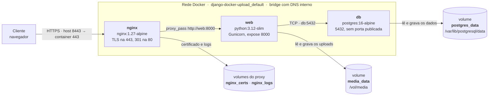

# Documentação técnica

**Geisbelly Victória** · **Nicole França Martins** — Computação em Nuvem

Aplicação Django containerizada em três serviços, com upload de arquivos
persistido em volume Docker.

Este documento responde, na ordem, aos oito itens pedidos no enunciado da defesa.
Tudo aqui corresponde ao código efetivamente entregue neste repositório — os
trechos de configuração são recortes dos arquivos reais, e os dados dos diagramas
foram lidos da stack em execução.

| # | Item | Seção |
|---|---|---|
| 1 | Visão geral da arquitetura | [↓](#1-visão-geral-da-arquitetura) |
| 2 | Imagem Docker da aplicação Django | [↓](#2-imagem-docker-da-aplicação-django) |
| 3 | Orquestração com Docker Compose | [↓](#3-orquestração-com-docker-compose) |
| 4 | Comunicação entre os containers | [↓](#4-comunicação-entre-os-containers) |
| 5 | Nginx e proxy reverso | [↓](#5-nginx-e-proxy-reverso) |
| 6 | Persistência de dados | [↓](#6-persistência-de-dados) |
| 7 | Fluxo do upload de um arquivo | [↓](#7-fluxo-do-upload-de-um-arquivo) |
| 8 | Análise técnica da solução | [↓](#8-análise-técnica-da-solução) |

---

## 1. Visão geral da arquitetura

A solução tem **três containers**, uma **rede interna** criada pelo Compose e
**quatro volumes nomeados**. Apenas o nginx publica porta no host, e a entrada é
por **HTTPS**.



### Componentes

| Serviço | Imagem | Responsabilidade |
|---|---|---|
| `nginx` | build de `nginx/Dockerfile`, sobre `nginx:1.27-alpine` | Proxy reverso e **terminação TLS**. Único ponto de entrada; encaminha **todas** as rotas para a aplicação. |
| `web` | build do `Dockerfile`, sobre `python:3.12-slim` | Django servido por Gunicorn. Valida, grava, lê e responde. |
| `db` | `postgres:16-alpine` (usada direto do registry) | Banco de dados. |

### Portas

| Onde | Porta | Exposição |
|---|---|---|
| host → nginx (HTTPS) | `${NGINX_TLS_PORT:-8443}` → `443` | **publicada** — é por onde se usa a aplicação |
| host → nginx (HTTP) | `${NGINX_PORT:-8080}` → `80` | **publicada** — só devolve `301` para o HTTPS |
| nginx → web | `8000` | interna (`expose`) — visível só na rede do Compose |
| web → db | `5432` | interna — o serviço `db` não declara porta nenhuma |

### Volumes

| Volume | Montagem | Conteúdo | Montado em |
|---|---|---|---|
| `media_data` | `/vol/media` | arquivos enviados pelos usuários | só no `web` |
| `postgres_data` | `/var/lib/postgresql/data` | dados do PostgreSQL | só no `db` |
| `nginx_certs` | `/etc/nginx/certs` | certificado TLS e chave privada | só no `nginx` |
| `nginx_logs` | `/var/log/nginx` | logs de acesso e de erro do proxy | só no `nginx` |

O `nginx` tem volume, mas **não toca na mídia**: os dois que ele monta guardam
coisas dele mesmo. Quem lê e escreve arquivo enviado é a aplicação.

> **Decisão:** três containers em vez de um só porque cada um tem um processo e
> um ciclo de vida próprios. Dá para atualizar a versão do nginx sem reconstruir
> a imagem do Django, escalar só o `web` se o gargalo for a aplicação, e trocar o
> Postgres por um serviço gerenciado sem mexer no resto.

---

## 2. Imagem Docker da aplicação Django

Arquivo: [`Dockerfile`](Dockerfile). Abaixo, cada decisão e o porquê.

### Imagem base: `python:3.12-slim`

```dockerfile
FROM python:3.12-slim
```

**Justificativa.** A `slim` usa **glibc**, então as *wheels* pré-compiladas do
PyPI instalam direto — inclusive a do `psycopg[binary]`, que é o driver do
Postgres. A alternativa comum, `alpine`, usa **musl**: as wheels não servem, o
pip cai para compilar a partir do fonte, e o build fica mais lento e mais frágil.
A imagem completa (`python:3.12`) traz compilador e ferramentas que a aplicação
não usa em execução — mais peso e mais superfície de vulnerabilidade. A `slim` é
o meio-termo entre tamanho e compatibilidade.

### Variáveis de build

```dockerfile
ENV PYTHONDONTWRITEBYTECODE=1 \
    PYTHONUNBUFFERED=1 \
    PIP_NO_CACHE_DIR=1
```

- `PYTHONDONTWRITEBYTECODE` — não gera `.pyc` dentro do container; eles seriam
  lixo na camada de escrita, já que a imagem é imutável.
- `PYTHONUNBUFFERED` — o Python escreve no `stdout` sem buffer, senão o log
  demoraria a aparecer no `docker logs`.
- `PIP_NO_CACHE_DIR` — o cache do pip não é reaproveitado entre builds de camadas
  diferentes, então guardá-lo só engorda a imagem.

### Instalação de dependências

```dockerfile
RUN apt-get update \
    && apt-get install -y --no-install-recommends postgresql-client \
    && rm -rf /var/lib/apt/lists/*
```

**Uma dependência de sistema, e só:** o `postgresql-client`, que traz o
`pg_isready` usado pelo `entrypoint.sh` para esperar o banco ficar pronto.

O driver do Postgres **não** precisa de biblioteca do sistema. O
`requirements.txt` pede `psycopg[binary]`, e o extra `binary` empacota a própria
`libpq` dentro da wheel — é justamente o que dispensa compilador no build. Dá
para conferir dentro do container:

```bash
$ docker compose exec web python -c "import psycopg; print(psycopg.pq.__impl__, psycopg.pq.version())"
binary 160000
```

`binary` é a implementação empacotada, e a `libpq` que ela usa é a 16.0 — a do
Debian da imagem é outra versão. A `libpq5` do sistema até é instalada, mas como
**dependência do próprio `postgresql-client`**, e o driver não a toca.

`--no-install-recommends` evita pacotes sugeridos que ninguém pediu, e o
`rm -rf /var/lib/apt/lists/*` **na mesma instrução** apaga o índice do apt antes
de a camada ser fechada. Em instrução separada não adiantaria: a camada anterior
já teria sido gravada com os arquivos dentro.

### WORKDIR e organização dos arquivos

```dockerfile
WORKDIR /app

COPY requirements.txt /app/requirements.txt
RUN pip install --no-cache-dir -r /app/requirements.txt

COPY app/ /app/
COPY entrypoint.sh /entrypoint.sh
```

O `WORKDIR /app` é o diretório de trabalho de todos os comandos seguintes e o
lugar onde o código da aplicação mora. Dentro da imagem fica assim:

```
/app/                    ← WORKDIR, conteúdo de app/ do repositório
├── manage.py
├── config/              ← settings, urls, wsgi
└── core/                ← model, validators, security, views, templates, testes
/entrypoint.sh           ← fora do WORKDIR, é script de infraestrutura
/vol/media/              ← ponto de montagem do volume de uploads
/vol/static/             ← saída do collectstatic (não é volume)
```

**A ordem das instruções é cache, não estética.** Cada instrução vira uma camada,
e o Docker reaproveita tudo até a primeira que mudou. O `requirements.txt` é
copiado e instalado **antes** do código:

| O que mudou | O que o Docker refaz |
|---|---|
| uma view em `app/core/views.py` | só `COPY app/` e o que vem depois — o `pip install` sai do cache |
| o `requirements.txt` | do `COPY requirements.txt` para baixo, reinstalando as dependências |

Na ordem inversa, **todo** build reinstalaria o Django inteiro.

### Usuário sem privilégio

```dockerfile
RUN useradd --uid 1000 --create-home appuser \
    && mkdir -p /vol/static /vol/media \
    && chown -R appuser:appuser /vol /app

USER appuser
```

O processo roda como `appuser`, não como root. Se a aplicação for comprometida
por uma falha de execução remota, o atacante não instala pacote, não altera
binário do sistema e não escreve fora do que lhe pertence.

**Por que criar `/vol/media` e dar `chown` antes de existir volume?** Porque
quando um volume nomeado **vazio** é montado sobre um diretório que já existe na
imagem, o Docker copia para dentro dele o conteúdo **e o dono** daquele
diretório. Sem esse `chown`, o volume nasceria pertencendo ao root e o `appuser`
não conseguiria gravar o upload.

### EXPOSE

```dockerfile
EXPOSE 8000
```

É **documentação da imagem**: declara em que porta o processo atende. Não publica
nada no host — quem publica é o `ports` do Compose, e só o nginx o usa.

### Inicialização: ENTRYPOINT + CMD

```dockerfile
ENTRYPOINT ["/entrypoint.sh"]
CMD ["gunicorn", "config.wsgi:application", \
     "--bind", "0.0.0.0:8000", \
     "--workers", "3", \
     "--timeout", "120", \
     "--access-logfile", "-", \
     "--error-logfile", "-"]
```

O `ENTRYPOINT` é o script que sempre roda; o `CMD` é o comando que ele recebe
como argumento e executa no fim. O [`entrypoint.sh`](entrypoint.sh) prepara o
ambiente antes de entregar o processo:

```sh
#!/bin/sh
set -e

echo "aguardando postgres em ${POSTGRES_HOST}:${POSTGRES_PORT}..."
until pg_isready -h "${POSTGRES_HOST}" -p "${POSTGRES_PORT}" -U "${POSTGRES_USER}" >/dev/null 2>&1; do
  sleep 1
done

python manage.py migrate --noinput
python manage.py collectstatic --noinput
# cria o superusuário se DJANGO_SUPERUSER_* estiver no .env

exec "$@"
```

1. **Espera o banco** com `pg_isready`. O Compose já usa `depends_on` com
   `condition: service_healthy`; o loop é o cinto além do suspensório.
2. **Aplica as migrações** — o schema nasce junto com o ambiente.
3. **Coleta os estáticos** em `/vol/static`.
4. **Cria o superusuário**, se as variáveis estiverem definidas.
5. **`exec "$@"`** — entrega o processo ao Gunicorn.

Dois detalhes que são decisão, não acaso:

- **`set -e`** derruba o container se uma migração falhar. É melhor falhar no boot
  do que subir e servir com o schema errado.
- **`exec`** faz o Gunicorn **substituir o shell** e virar o **PID 1**. Sem ele, o
  shell continuaria sendo o PID 1 e não repassaria o `SIGTERM` que o Docker envia
  no `stop` — o container morreria por timeout em vez de desligar limpo.

### Gunicorn

`manage.py runserver` foi descartado: é o servidor de desenvolvimento, e a própria
documentação do Django diz para não usá-lo em produção. Ele é processo único, com
recarregamento automático de código, não gerencia workers (nada reinicia um
processo travado ou vazando memória) e não limita o tamanho do corpo da
requisição.

O Gunicorn é um servidor **WSGI** de produção. Ele carrega o objeto `application`
de `config/wsgi.py` — o contrato padrão entre servidor e aplicação Python, que é
o que permite trocar o servidor sem mudar o Django. Configuração usada:

| Parâmetro | Valor | Por quê |
|---|---|---|
| `--bind 0.0.0.0:8000` | todas as interfaces | precisa aceitar conexão vinda do container do nginx, não só de `localhost` |
| `--workers 3` | 3 processos | a regra prática é `2 × núcleos + 1`; dentro de container prefiro um número fixo e previsível, e escalar réplicas do serviço em vez de workers no processo |
| `--timeout 120` | 120s | casado com o `proxy_read_timeout` do nginx (ver seção 5) |
| `--access-logfile -` / `--error-logfile -` | `stdout` | é de onde o Docker coleta log; gravar em arquivo dentro do container esconderia o log |

---

## 3. Orquestração com Docker Compose

Arquivo: [`docker-compose.yml`](docker-compose.yml). Ele é a **infraestrutura
como código** do projeto: descreve o estado desejado (serviços, rede, volumes) em
vez da sequência de comandos, e sobe tudo com `docker compose up -d`.

### Serviço `db`

```yaml
db:
  image: postgres:16-alpine
  restart: unless-stopped
  environment:
    POSTGRES_DB: ${POSTGRES_DB}
    POSTGRES_USER: ${POSTGRES_USER}
    POSTGRES_PASSWORD: ${POSTGRES_PASSWORD}
  volumes:
    - postgres_data:/var/lib/postgresql/data
  healthcheck:
    test: ["CMD-SHELL", "pg_isready -U ${POSTGRES_USER} -d ${POSTGRES_DB}"]
    interval: 5s
    timeout: 5s
    retries: 10
```

| Aspecto | Valor |
|---|---|
| **Imagem** | `postgres:16-alpine` — usada direto do registry, sem build |
| **Responsabilidade** | guardar os dados relacionais |
| **Portas** | **nenhuma** publicada nem declarada — alcançável só pela rede do Compose |
| **Variáveis** | `POSTGRES_DB`, `POSTGRES_USER`, `POSTGRES_PASSWORD`, vindas do `.env` |
| **Volumes** | `postgres_data` em `/var/lib/postgresql/data` |
| **Dependências** | nenhuma; é o primeiro a subir |
| **Inicialização** | `restart: unless-stopped` + `healthcheck` com `pg_isready` a cada 5s |

O **healthcheck** é o que torna o boot confiável: "container em execução" não é o
mesmo que "banco aceitando conexão". Sem ele, o `web` tentaria migrar num Postgres
ainda inicializando.

### Serviço `web`

```yaml
web:
  build: .
  restart: unless-stopped
  env_file: .env
  volumes:
    - media_data:/vol/media
  depends_on:
    db:
      condition: service_healthy
  expose:
    - "8000"
```

| Aspecto | Valor |
|---|---|
| **Imagem** | construída do `Dockerfile` na raiz (`build: .`) |
| **Responsabilidade** | executar o Django sob Gunicorn: validar, gravar, ler, responder |
| **Portas** | `expose: 8000` — declarada na rede interna, **não publicada** |
| **Variáveis** | o `.env` inteiro, via `env_file` (SECRET_KEY, hosts, credenciais, limites de upload) |
| **Volumes** | `media_data` em `/vol/media` |
| **Dependências** | `depends_on: db` com `condition: service_healthy` |
| **Inicialização** | `restart: unless-stopped`; o `entrypoint.sh` prepara o ambiente a cada boot |

### Serviço `nginx`

```yaml
nginx:
  build: ./nginx
  restart: unless-stopped
  environment:
    TLS_PORT_PUBLICA: ${NGINX_TLS_PORT:-8443}
    TLS_CN: ${TLS_CN:-localhost}
  ports:
    - "${NGINX_PORT:-8080}:80"
    - "${NGINX_TLS_PORT:-8443}:443"
  volumes:
    - nginx_certs:/etc/nginx/certs
    - nginx_logs:/var/log/nginx
  depends_on:
    - web
```

| Aspecto | Valor |
|---|---|
| **Imagem** | construída de `nginx/Dockerfile`, sobre `nginx:1.27-alpine`, com `openssl` e a configuração |
| **Responsabilidade** | proxy reverso, terminação TLS e registro de acesso |
| **Portas** | `8443:443` (HTTPS, o caminho real) e `8080:80` (só redireciona) — **as únicas publicadas** |
| **Variáveis** | `TLS_PORT_PUBLICA`, usada pelo `envsubst` no redirecionamento, e `TLS_CN`, o nome no certificado |
| **Volumes** | `nginx_certs` para o certificado e `nginx_logs` para os logs |
| **Dependências** | `depends_on: web` (ordem de subida, sem healthcheck) |
| **Inicialização** | `restart: unless-stopped`; o `entrypoint.sh` gera o certificado se ele não existir |

> **Por que construir uma imagem para o nginx em vez de montar a config por bind
> mount?** O bind mount amarraria o container a um caminho da máquina do host, o
> que quebra a portabilidade que a containerização existe para dar. A imagem
> carrega a configuração dentro dela e roda igual em qualquer lugar.

### Rede e volumes

```yaml
volumes:
  postgres_data:   # dados do PostgreSQL
  media_data:      # arquivos enviados pelo upload
  nginx_certs:     # certificado TLS gerado na primeira subida
  nginx_logs:      # logs de acesso e de erro do proxy
```

Nenhuma rede é declarada explicitamente: o Compose cria a rede padrão do projeto,
`django-docker-upload_default`, e liga os três serviços nela (detalhe na seção 4).

### Política de inicialização

Os três usam `restart: unless-stopped`: o Docker sobe o container de novo se ele
cair, e só para de tentar se alguém o parar de propósito. No `web`, o reinício é
seguro porque `migrate` e `collectstatic` são **idempotentes** — rodar de novo não
quebra nada.

A ordem de subida é `db` → (healthy) → `web` → `nginx`.

---

## 4. Comunicação entre os containers

### Como eles se acham: rede e DNS interno

O Compose cria uma **rede bridge** própria do projeto e conecta os três serviços
a ela. Dentro dessa rede existe um **servidor DNS embutido do Docker**, em
`127.0.0.11`, e **o nome de cada serviço vira hostname**.

É por isso que não há IP fixo em lugar nenhum da configuração: o nginx procura
por `web`, e o Django procura por `db`. Se o container for recriado e ganhar
outro IP, o nome continua resolvendo.

```
$ docker network ls | grep django-docker-upload
django-docker-upload_default   bridge   local
```

### Nginx → Django/Gunicorn

O nginx define o destino num bloco `upstream` e encaminha por HTTP:

```nginx
upstream django {
    server web:8000;   # "web" é o nome do serviço, resolvido pelo DNS do Docker
}

location / {
    proxy_pass http://django;
}
```

A requisição sai do nginx na rede interna e chega ao Gunicorn, que escuta em
`0.0.0.0:8000` dentro do container `web`. Essa porta está declarada com `expose`:
existe na rede do Compose e **não** no host.

### Django → PostgreSQL

O Django abre conexão TCP com o Postgres usando o driver `psycopg`, com o host
lido do ambiente:

```python
# app/config/settings.py
DATABASES = {
    "default": {
        "ENGINE": "django.db.backends.postgresql",
        "NAME": os.environ.get("POSTGRES_DB", "appdb"),
        "USER": os.environ.get("POSTGRES_USER", "appuser"),
        "PASSWORD": os.environ.get("POSTGRES_PASSWORD", "apppass"),
        "HOST": os.environ.get("POSTGRES_HOST", "db"),   # ← nome do serviço
        "PORT": os.environ.get("POSTGRES_PORT", "5432"),
        "OPTIONS": {
            "connect_timeout": 5,
            "options": "-c statement_timeout=15000",
        },
    }
}
```

`POSTGRES_HOST=db` no `.env`: de novo, o nome do serviço. O Postgres escuta na
5432 dentro da rede, e o serviço não declara `ports` nem `expose` — nada fora da
rede do Compose chega até ele.

### Portas internas e externas, lado a lado

| Diretiva | Onde | Efeito |
|---|---|---|
| `ports: "8080:80"` | `nginx` | **publica** no host: `localhost:8080` funciona |
| `expose: "8000"` | `web` | declara na rede interna; **não** publica |
| *(nada)* | `db` | nem declara; só é alcançado por quem está na rede |

A consequência de segurança é direta: **a superfície exposta é uma porta só**. O
banco não é alcançável da máquina do avaliador, nem da internet.

---

## 5. Nginx e proxy reverso

### O papel dele

Um **proxy reverso** é um servidor que recebe a requisição do cliente em nome do
servidor de aplicação. O navegador só conversa com o nginx; quem fala com o
Gunicorn é o nginx, pela rede interna.

Nesta solução ele faz **três coisas, e só**:

1. **Ponto único de entrada** — é o único container com porta publicada.
2. **Limite de corpo** — corta um upload gigante no perímetro, antes de ocupar um
   worker do Gunicorn.
3. **Repasse de cabeçalhos** — informa à aplicação por onde a requisição entrou.

Ele **não serve arquivo de usuário**: encaminha todas as rotas, inclusive
`/static/` e `/media/`, para a aplicação. Foi uma decisão deliberada de manter o
proxy com um papel só. O custo está registrado na seção 8.

### A configuração, trecho a trecho

Arquivo: [`nginx/default.conf.template`](nginx/default.conf.template).

```nginx
upstream django {
    server web:8000;
}
```

Define o grupo de destino. Usar `upstream` em vez de escrever o endereço direto
no `proxy_pass` deixa o caminho pronto para **balanceamento**: com
`docker compose up --scale web=3`, o nginx resolve o nome do serviço e distribui
entre as réplicas.

```nginx
server {
    listen 80;
    server_name _;
```

Escuta na porta 80 **dentro do container** — quem faz `8080 → 80` é o `ports` do
Compose. O `server_name _` é um coringa: atende qualquer Host, porque em
desenvolvimento o endereço varia (`localhost`, `127.0.0.1`, o IP da máquina).

```nginx
    client_max_body_size 100M;
```

Teto do corpo da requisição. Acima disso o nginx responde **413** e **encerra sem
chamar a aplicação** — um upload gigante não chega a gastar worker do Gunicorn.
Não confundir com o limite de negócio de 10 MB (seção 8).

```nginx
    location / {
        proxy_pass http://django;
```

Uma `location` só, casando com tudo. **Toda** rota vai para a aplicação.

```nginx
        proxy_set_header Host $http_host;
```

O trecho mais importante da configuração, e o que já causou um bug real.
`$http_host` preserva o cabeçalho `Host` **com a porta** (`localhost:8080`);
`$host` descartaria a porta. Com `$host`, o Django via o host como `localhost`
enquanto o navegador mandava `Origin: http://localhost:8080` — os dois não batiam,
e a verificação de CSRF **reprovava todo POST com 403**.

```nginx
        proxy_set_header X-Real-IP $remote_addr;
        proxy_set_header X-Forwarded-For $proxy_add_x_forwarded_for;
        proxy_set_header X-Forwarded-Proto $scheme;
```

Sem eles, a aplicação enxergaria todas as requisições vindo do IP do container do
nginx. O `X-Forwarded-Proto` diz se a origem era HTTP ou HTTPS, e o Django o lê
por causa do `SECURE_PROXY_SSL_HEADER` no `settings.py` — é o que faz o Django
saber que a origem era HTTPS, mesmo recebendo a requisição em HTTP pela rede
interna, e é o que permite os cookies `Secure`.

```nginx
        proxy_redirect off;
        proxy_read_timeout 120s;
    }
}
```

`proxy_redirect off` mantém o `Location` como a aplicação o escreveu, em vez de o
nginx reescrevê-lo. `proxy_read_timeout 120s` é **igual** ao `--timeout 120` do
Gunicorn, de propósito: se o do nginx fosse menor, o cliente levaria **504**
enquanto o worker ainda estivesse processando o upload.

### TLS: onde o HTTPS comeca e termina

```nginx
server {
    listen 443 ssl;
    http2 on;

    ssl_certificate     /etc/nginx/certs/server.crt;
    ssl_certificate_key /etc/nginx/certs/server.key;

    ssl_protocols       TLSv1.2 TLSv1.3;
    ssl_session_cache   shared:SSL:10m;
}
```

O HTTPS **termina no proxy**: do nginx para o Gunicorn o tráfego corre em HTTP,
dentro da rede interna, que não é alcançável de fora. É o desenho normal — TLS de
ponta a ponta só se justifica quando a rede entre proxy e aplicação não é
confiável.

`ssl_protocols TLSv1.2 TLSv1.3` deixa de fora as versões antigas; 1.0 e 1.1 estão
obsoletos desde 2021.

**O certificado é autoassinado**, gerado pelo `nginx/entrypoint.sh` na primeira
subida e guardado no volume `nginx_certs`:

```sh
openssl req -x509 -nodes -newkey rsa:2048 -days 825 \
  -subj "/C=BR/O=Defesa Computacao em Nuvem/CN=${CN}" \
  -addext "subjectAltName=DNS:${CN},DNS:localhost,IP:127.0.0.1"
```

O navegador vai avisar que não confia nele, e está certo: quem atesta um
certificado é uma autoridade certificadora, e aqui não há nenhuma. O
autoassinado entrega a **criptografia do tráfego**; o que falta é a **prova de
identidade**. Em produção o passo é Let's Encrypt — está na seção 8.

Ele fica num volume de propósito: gerado a cada boot, mudaria de impressão
digital toda vez e invalidaria qualquer exceção já aceita no navegador.

### O redirecionamento de HTTP, e por que a porta entra por variável

```nginx
server {
    listen 80;
    return 301 https://$host:${TLS_PORT_PUBLICA}$request_uri;
}
```

A porta 80 não serve nada: devolve `301` e acabou. O detalhe é o
`${TLS_PORT_PUBLICA}`. Dentro do container o TLS está na 443, mas no host ele
está publicado em 8443 — redirecionar para `https://$host` mandaria o navegador
para a 443 **do host**, onde não há nada. A variável vem do Compose e é
substituída pelo `envsubst` do entrypoint da própria imagem, e é por isso que o
arquivo é um `default.conf.template`.

É o mesmo tipo de erro do `$host` contra `$http_host`: esquecer a porta quando
ela não é a padrão.

### Os logs

```nginx
log_format detalhado '$remote_addr - $remote_user [$time_local] '
                     '"$request" $status $body_bytes_sent '
                     '"$http_referer" "$http_user_agent" '
                     'req=${request_time}s upstream=${upstream_response_time}s';

access_log /var/log/nginx/access.log detalhado;
access_log /dev/stdout detalhado;
error_log  /var/log/nginx/error.log warn;
```

Ao formato `combined` padrão foram acrescentados **dois tempos**:
`request_time`, quanto durou a requisição inteira do ponto de vista do nginx, e
`upstream_response_time`, quanto o Gunicorn levou para responder. A diferença
entre os dois é o tempo gasto na rede e no proxy — é assim que se separa
lentidão da aplicação de lentidão do caminho.

Cada log tem **dois destinos**: o arquivo no volume, que sobrevive ao container,
e a saída padrão, de onde o `docker compose logs` lê. Sem o segundo, o volume
quebraria o `docker logs`; sem o primeiro, o histórico morreria com o container.

Duas linhas reais, um acesso e um redirecionamento:

```
192.168.65.1 - - [26/Sep/2026:13:57:14 +0000] "GET /accounts/login/ HTTP/2.0" 200 5367 "-" "curl/8.7.1" req=0.024s upstream=0.023s
192.168.65.1 - - [26/Sep/2026:13:57:14 +0000] "GET / HTTP/1.1" 301 169 "-" "curl/8.7.1" req=0.000s upstream=-s
```

O `upstream=-s` da segunda diz que aquela requisição **não chegou à aplicação**:
foi respondida pelo próprio nginx, com o `301`.

**Limite conhecido:** não há rotação. Um `access.log` cresce sem parar, e em
produção isso pede `logrotate` ou coleta centralizada — está na seção 8.

---

## 6. Persistência de dados

### A volatilidade do container

Um container roda a partir de uma **imagem imutável**, com uma **camada de escrita
efêmera** por cima. Tudo que o processo escreve fora de um volume vai para essa
camada — e ela é **destruída junto com o container**. Recriar o container a partir
da mesma imagem devolve o estado original.

É por isso que estado não pode morar dentro do container. Os dois tipos de estado
desta solução foram tratados **separadamente**, porque têm ciclos de vida e formas
de backup diferentes.

### Persistência dos dados do PostgreSQL

```yaml
db:
  volumes:
    - postgres_data:/var/lib/postgresql/data
```

`/var/lib/postgresql/data` é o diretório de dados do Postgres — tabelas, índices,
usuários, WAL. Montando o volume ali, quem escreve é o processo do banco, no
formato dele. Backup e restauração se fazem com `pg_dump` / `pg_restore`.

### Persistência dos arquivos enviados

```yaml
web:
  volumes:
    - media_data:/vol/media
```

```python
# app/config/settings.py
MEDIA_ROOT = "/vol/media"
```

**A frase que resume a solução:** o diretório onde o Django grava **é** o ponto de
montagem do volume. O `FileField` grava em `MEDIA_ROOT/uploads/<nome>`, que é
`/vol/media/uploads/<nome>` — dentro do volume, nunca na camada de escrita do
container. Backup se faz empacotando o volume:

```bash
docker run --rm -v django-docker-upload_media_data:/data -v "$PWD":/backup \
  alpine tar czf /backup/media.tgz /data
```

No banco fica apenas o **caminho relativo**, numa coluna `varchar(100)` — os bytes
nunca entram no Postgres. Binário dentro do banco infla o `pg_dump`, deixa o
restore lento e prende o arquivo ao ciclo de vida do banco.

### Por que quatro volumes, e não menos

Cada um guarda um tipo de estado com ciclo de vida próprio:

- **`postgres_data` e `media_data` não se juntam:** o primeiro é escrito pelo
  processo do Postgres, que precisa mandar sozinho naquele diretório, e se
  recupera com `pg_dump`; o segundo guarda arquivo de usuário, que se copia com
  `tar`. Juntá-los misturaria permissões e tornaria o backup de um dependente do
  outro.
- **`nginx_certs` existe para o certificado não mudar a cada boot.** Se fosse
  gerado toda vez, a impressão digital mudaria e o navegador voltaria a avisar,
  além de invalidar qualquer exceção que já tivesse sido aceita.
- **`nginx_logs` guarda o histórico de acesso e de erro**, que de outro modo
  morreria com o container.
- **O que ficou de fora:** existia um `static_data` para a saída do
  `collectstatic`, e ele foi **removido**. Aquele diretório é regenerado a cada
  boot a partir da própria imagem — não é estado, é resultado derivado.

> **Uma armadilha que custou tempo:** a imagem do nginx traz `access.log` e
> `error.log` como *symlinks* para `/dev/stdout` e `/dev/stderr`. Como um volume
> vazio montado sobre um diretório da imagem **copia o conteúdo dele**, o volume
> nasceu com os symlinks dentro, e escrever no "arquivo" continuava caindo na
> saída padrão — o volume ficava vazio. A solução foi apagar os symlinks no
> `Dockerfile`, para o diretório nascer limpo. É o mesmo mecanismo que faz o
> `/vol/media` herdar o dono `appuser`, com a consequência invertida.

### O que acontece se os containers forem removidos e recriados

| Comando | Containers | Rede | Volumes | Os arquivos enviados |
|---|---|---|---|---|
| `docker compose stop` | parados | mantida | mantidos | **intactos** |
| `docker compose down` | **removidos** | **removida** | **mantidos** | **intactos** |
| `docker compose up -d --build` | recriados, imagem nova | recriada | remontados | **intactos** |
| `docker compose down -v` | removidos | removida | **apagados** | **perdidos** (e o certificado e os logs também) |

Volume nomeado é um objeto **separado** no Docker: não pertence a container
nenhum. O `down` remove containers e rede; o volume fica, e é remontado no
container novo com o mesmo conteúdo. A verificação é direta:

```bash
docker compose down
docker compose up -d
docker compose exec web ls -l /vol/media/uploads   # os arquivos continuam lá
```

O `-v` é o **único** comando do fluxo normal que apaga os volumes — e apaga
porque foi pedido, não por acidente.

> **Por que volume nomeado e não bind mount?** O bind mount aponta para uma pasta
> específica da máquina: muda de caminho entre Windows e Linux e quebra na
> entrega. O volume nomeado é gerenciado pelo Docker, não depende de caminho do
> host e herda o dono do diretório que já existe na imagem.

---

## 7. Fluxo do upload de um arquivo

Caminho: **Navegador → Nginx → Django → Volume persistente**, com o caminho do
arquivo indo para o banco.

```mermaid
sequenceDiagram
    autonumber
    actor U as Usuário
    participant N as nginx<br/>(proxy reverso)
    participant D as Django<br/>(Gunicorn, container web)
    participant V as Volume<br/>media_data
    participant P as PostgreSQL<br/>(container db)

    U->>N: POST / &nbsp;·&nbsp; multipart + cookie de sessão
    Note over N: client_max_body_size 100M<br/>acima disso: 413, sem chamar a aplicação
    N->>D: proxy_pass http://web:8000<br/>Host, X-Real-IP, X-Forwarded-*

    Note over D: @login_required<br/>sem sessão → 302 para /accounts/login/

    Note over D: validação em camadas:<br/>nome · extensão · tamanho · assinatura

    alt arquivo reprovado
        D-->>U: 200 · formulário com a mensagem de erro
        Note over V,P: nada é gravado
    else arquivo aprovado
        D->>V: grava os bytes em /vol/media/uploads/&lt;nome&gt;
        V-->>D: caminho relativo: uploads/&lt;nome&gt;
        D->>P: INSERT core_documento (titulo, arquivo, enviado_em, enviado_por_id)
        P-->>D: id
        D-->>U: 302 para / &nbsp;(POST/Redirect/GET)
    end

    U->>N: GET /media/uploads/&lt;nome&gt;
    N->>D: proxy_pass
    D->>V: lê o arquivo do volume
    D-->>U: 200 · Content-Disposition: attachment · nosniff
```

### Passo a passo

1. **O navegador envia** um POST multipart do formulário da home, com o cookie de
   sessão. Sem sessão válida o `@login_required` redireciona para o login e o
   upload não chega a ser tentado.
2. **O nginx recebe** na porta 8080 do host, confere o tamanho do corpo contra
   `client_max_body_size 100M` e encaminha para `web:8000`. Ele não abre o arquivo
   e não guarda nada.
3. **O Django valida**, em camadas baratas primeiro: nome do arquivo (sem
   separador de caminho, quebra de linha ou caractere invisível), extensão contra
   a lista do `.env`, tamanho contra `UPLOAD_MAX_SIZE_MB`, e por fim o **conteúdo**
   — os primeiros bytes têm de corresponder à extensão. Reprovou em qualquer uma,
   **nada é gravado** e o erro volta no formulário.
4. **O `FileField` grava os bytes** em `/vol/media/uploads/<nome>`, dentro do
   volume. Se já existir arquivo com o mesmo nome, o storage do Django acrescenta
   um sufixo aleatório — nada é sobrescrito.
5. **O banco recebe só o caminho relativo**, mais título, data e quem enviou.
6. **A resposta é um redirect** (padrão POST/Redirect/GET): recarregar a página não
   reenvia o arquivo.
7. **No download**, o caminho é o mesmo de volta: o nginx encaminha, a aplicação lê
   o arquivo do volume e devolve com `Content-Disposition: attachment` e
   `X-Content-Type-Options: nosniff`. Só imagem rasterizada abre no navegador.

---

## 8. Análise técnica da solução

### Três vantagens da arquitetura implementada

1. **O estado sobrevive à infraestrutura.** Os containers são descartáveis e os
   dois tipos de estado moram fora deles, em volumes nomeados. Dá para destruir e
   recriar os três containers, ou reconstruir as imagens, sem perder um arquivo
   nem um registro. É o que permite atualizar a aplicação sem janela de
   manutenção destrutiva.

2. **Superfície de ataque reduzida a uma porta.** Só o nginx publica porta no
   host; o `web` usa `expose` e o `db` não declara nada. O banco não é alcançável
   da máquina do host nem da rede externa. Some-se a isso o processo rodando como
   usuário sem privilégio e os segredos fora do Git.

3. **Portabilidade e paridade entre ambientes.** A unidade de entrega é uma
   imagem OCI mais um arquivo declarativo. A mesma imagem que roda aqui roda em
   qualquer provedor, sem nada no código conhecer fornecedor nenhum — o ambiente
   inteiro se recria com um comando, e o que o avaliador executa é o mesmo que foi
   desenvolvido.

### Três limitações da implementação atual

1. **A validação de conteúdo olha só o começo do arquivo.** A assinatura dos
   primeiros bytes pega um executável renomeado para `.pdf`, mas um PDF com
   cabeçalho correto e conteúdo malicioso passaria. Uma biblioteca dedicada
   cobriria mais formatos e mais casos.

2. **Autenticação sem autorização.** Enviar e baixar exigem sessão, mas qualquer
   pessoa autenticada vê e baixa os arquivos de todos. Não há separação por dono
   nem uso do sistema de permissões do Django.

3. **Presa a um único host, e com certificado próprio.** O volume local não é
   visto por réplicas em nós diferentes, o `migrate` roda no boot do `web`
   (seguro com uma réplica, arriscado com várias subindo juntas), e o
   certificado TLS é autoassinado — o navegador avisa, porque nenhuma autoridade
   o atesta. Os logs ficam num volume, mas sem rotação nem centralização.

### Três melhorias para aproximar de produção

1. **Certificado de uma autoridade** no lugar do autoassinado — com Let's
   Encrypt e renovação automática —, e **HSTS** ligado junto, pela variável
   `DJANGO_HSTS_SECONDS` que já existe. Hoje ela fica em `0` de propósito: HSTS
   com certificado próprio em `localhost` prende o navegador a HTTPS naquele
   host por semanas, e atrapalha mais do que protege.

2. **Trocar o volume local por *object storage*** (S3 ou MinIO) e **tirar o
   `migrate` do boot**, rodando-o como job separado. São as duas mudanças que
   destravam a escala horizontal: com elas, `docker compose up --scale web=3`
   passa a funcionar de verdade, e não só no nível de rede.

3. **Segredos fora de arquivo e observabilidade.** Usar o mecanismo de secrets do
   orquestrador em vez do `.env`, centralizar os logs que hoje ficam no
   `docker logs`, e rodar os 41 testes num pipeline de CI antes de qualquer
   deploy.

---

## Onde conferir cada coisa no repositório

| Arquivo | O quê |
|---|---|
| [`Dockerfile`](Dockerfile) | imagem da aplicação |
| [`entrypoint.sh`](entrypoint.sh) | preparação do ambiente no boot |
| [`docker-compose.yml`](docker-compose.yml) | serviços, rede, volumes |
| [`nginx/default.conf.template`](nginx/default.conf.template) | proxy reverso |
| [`app/config/settings.py`](app/config/settings.py) | `MEDIA_ROOT`, banco, segurança |
| [`app/core/models.py`](app/core/models.py) | o model `Documento` e os validadores |
| [`app/core/security.py`](app/core/security.py) | assinaturas, nome seguro, tipos servidos |
| [`app/core/views.py`](app/core/views.py) | home, healthcheck e a entrega de `/media/` |
| [`app/core/tests.py`](app/core/tests.py) | 41 testes |
| [`defesa/DEFESA.md`](defesa/DEFESA.md) | roteiro da apresentação e perguntas prováveis |
| [`defesa/apresentacao-defesa.html`](defesa/apresentacao-defesa.html) | o deck, com simulador animado |
